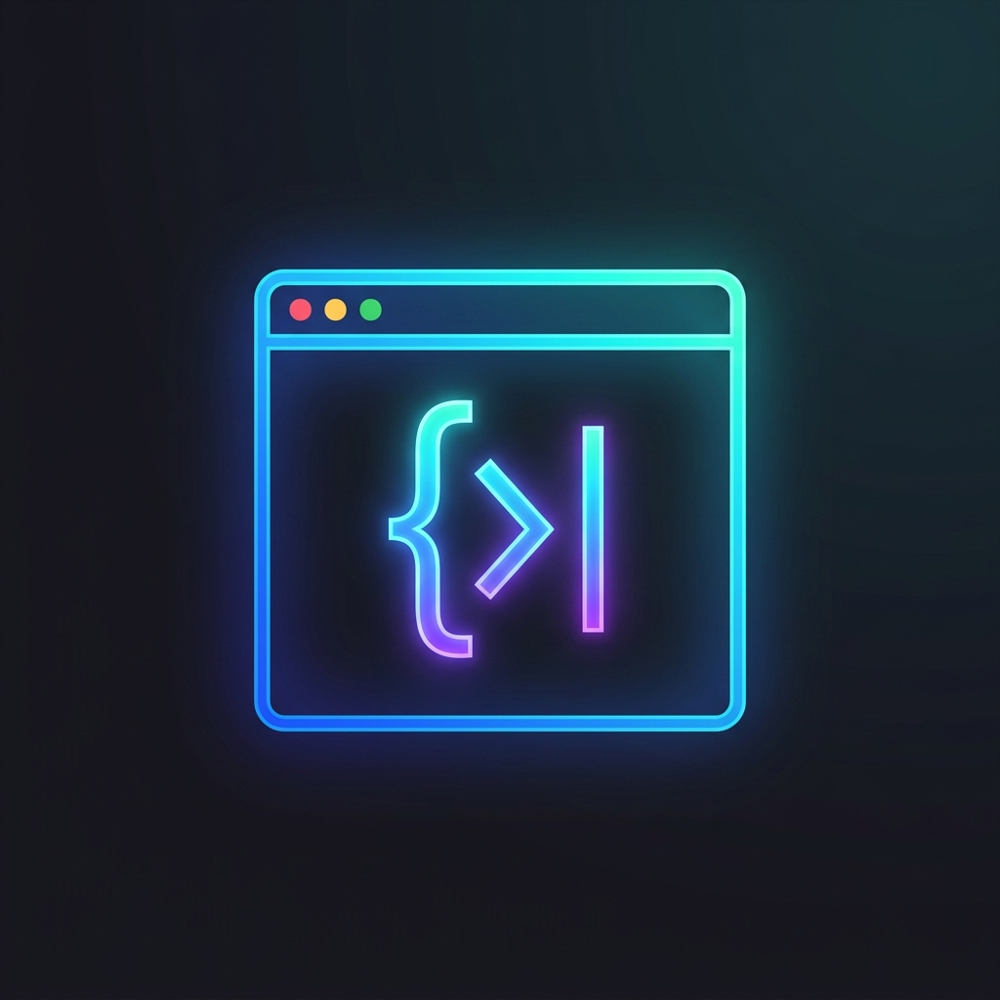
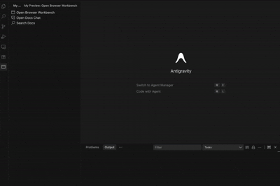

# Inside Editor Browser + Docs

Bring the modern, agentic IDE browser experience directly into VS Code! 

This extension provides a fully featured, CDP-backed headless browser inside a VS Code webview panel, allowing you to instantly view your live apps, interact with them, and **extract precise DOM context for AI chat agents**. It perfectly bridges the gap between your editor, your browser, and your AI assistant.

  

  

## ✨ Key Features

### 🌐 Built-in Browser Workbench
- **Activity Bar Integration**: Quickly access the browser and docs from the custom Activity Bar view.
- **Context Menu Launch**: Right-click any URL in your code and select **Open in Built-in Browser (My Preview)**.
- **Full Navigation**: URL bar, back, forward, reload, and hard reload (`Page.reload({ ignoreCache: true })`).
- **High Fidelity**: Powered by Chrome DevTools Protocol (CDP) connecting to a real headless Chromium/Chrome/Edge instance, completely bypassing standard iframe restrictions.

### 🎯 Element Picker + Inspector
- **Pick Mode**: Interactively hover over the live webview to highlight DOM nodes.
- **Inspector Tooltip**: Instantly see the tag name, selector path, and precise dimensions of elements.
- **AI Context Extraction**: Click any element to automatically insert its HTML/DOM context into your active editor or copy it to your clipboard. You can instantly pass this to Copilot Chat, Cursor Chat, or Cline!

### 📚 Docs Search & Chat
- **Docs Search**: Search internal or external documentation directly from VS Code.
- **Docs Chat**: Dedicated chat interface for querying documentation.

## 🚀 Getting Started

1. **Launch from the Sidebar**: Click the new "My Preview" icon in your Activity Bar and click "Open Browser Workbench".
2. **Right Click Links**: Select a URL in your code, right-click, and choose **Open in Built-in Browser (My Preview)**.
3. **Pick Elements**: Click the **Pick** button in the browser toolbar, hover over your page, and click an element. Its HTML will be copied for your AI!

## ⚙️ Configuration

- `myPreview.browserExecutablePath`
  - Optional explicit path to Chrome, Chromium, or Edge.
- `myPreview.allowLocalhost`
  - Defaults to `true` to allow local development.
- `myPreview.viewportWidth` & `myPreview.viewportHeight`
  - Customizes the default dimensions of the headless browser.

## 🛠 Troubleshooting

**Blank Or Stale Screenshot:**
- macOS users may encounter issues if the extension host suspends background GPU processes. We automatically pass `--disable-gpu` to mitigate this, but if you still see issues, try clicking `Hard Reload`.

**Browser Not Found:**
If the extension cannot find your Chrome installation automatically, set `myPreview.browserExecutablePath` in your VS Code settings to one of:
- macOS: `/Applications/Google Chrome.app/Contents/MacOS/Google Chrome`
- Windows: `C:\\Program Files\\Google\\Chrome\\Application\\chrome.exe`
- Linux: `/usr/bin/google-chrome`

## 🤝 Contributing

This extension is completely **open source**, and I would be incredibly happy if you contributed! Whether it's fixing bugs, improving the headless browser performance, or adding new features for AI workflows, all PRs are welcome. 

1. Fork the repository
2. Create your feature branch (`git checkout -b feature/AmazingFeature`)
3. Commit your changes (`git commit -m 'Add some AmazingFeature'`)
4. Push to the branch (`git push origin feature/AmazingFeature`)
5. Open a Pull Request
