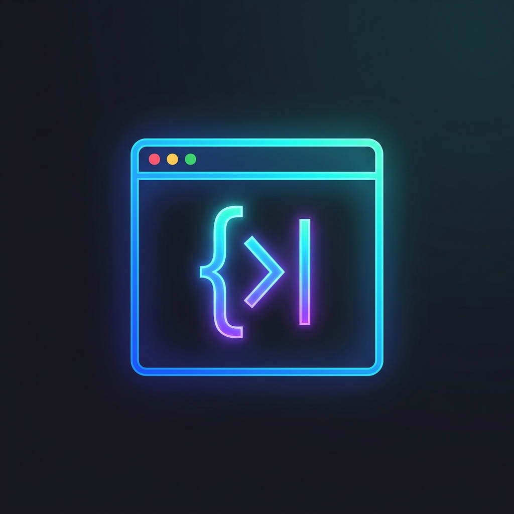
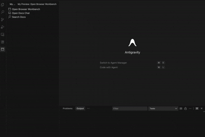

# Inside Editor Browser

Bring the modern, agentic IDE browser experience directly into VS Code and Cursor!

This extension provides a fully featured, CDP-backed headless browser inside a VS Code webview panel, allowing you to instantly view your live apps, interact with them, and **send precise DOM elements and screenshots straight into the IDE agent's chat input**. It perfectly bridges the gap between your editor, your browser, and your AI assistant.

  

  

## ✨ Key Features

### 🌐 Built-in Browser Workbench
- **Activity Bar Integration**: Quickly access the browser and docs from the custom Activity Bar view.
- **Context Menu Launch**: Right-click any URL in your code and select **Open in Built-in Browser (My Preview)**.
- **Full Navigation**: URL bar, back, forward, reload, and hard reload (`Page.reload({ ignoreCache: true })`).
- **High Fidelity**: Powered by Chrome DevTools Protocol (CDP) connecting to a real headless Chromium/Chrome/Edge instance, completely bypassing standard iframe restrictions.

### 🎯 Element Picker + Inspector
- **Pick Mode**: Click the **Pick** button, then click elements on the page — pick mode stays active so you can chain multiple selections.
- **Inspector Tooltip**: Instantly see the tag name, selector path, and precise dimensions of elements.
- **Auto-paste to Agent**: Each picked element is auto-pasted into the IDE agent's chat input as a compact 3-line block (DOM Path, Position, HTML Element) with a stable `data-cursor-element-id` so the agent can reference each pick.
- **SVG promotion**: Picking inside an SVG (e.g. a `path`) automatically promotes the pick to the owning `<svg>`, so you don't paste multi-KB path data.
- **Components Tree**: A side panel inside the preview shows every picked element as a hierarchical tree.

### 📸 Screenshots Into Chat
- **Full-page Screenshot** and **Capture Area** toolbar buttons place an actual image on your OS clipboard and paste it directly into the agent's chat input — not as a file path.

### 🎨 CSS Inspector
- A toolbar button opens a CSS inspector for the currently picked element, with apply / reset / undo / redo.

## 🚀 Getting Started

1. **Launch from the Sidebar**: Click the "My Preview" icon in your Activity Bar and click "Open Browser Workbench".
2. **Right Click Links**: Select a URL in your code, right-click, and choose **Open in Built-in Browser (My Preview)**.
3. **Pick Elements**: Click the **Pick** button in the browser toolbar, hover over your page, and click an element. It auto-pastes into the IDE agent's chat. Press `Esc` to leave pick mode.
4. **Send a Screenshot**: Click the camera or capture-area icon — the image goes straight into the agent's chat input.

## ⚙️ Configuration

- `myPreview.browserExecutablePath`
  - Optional explicit path to Chrome, Chromium, or Edge.
- `myPreview.allowLocalhost`
  - Defaults to `true` to allow local development.
- `myPreview.viewportWidth` & `myPreview.viewportHeight`
  - Customizes the default dimensions of the headless browser.
- `myPreview.deviceScaleFactor` (default `2`)
  - Render at retina pixel density for crisp screenshots. Lower to `1` for faster but blurrier rendering on slow machines.
- `myPreview.screenshotFormat` (`jpeg` / `png`) and `myPreview.jpegQuality` (default `92`)
  - Controls preview encoding. PNG is sharpest; JPEG is faster.
- `myPreview.promoteSvgPicksToRoot` (default `true`)
  - When picking inside an SVG, paste the owning `<svg>` instead of the inner element.
- `myPreview.maxAgentAttributeLength` (default `120`)
  - Truncate long attributes (e.g. SVG `d`, `style`, data URLs) in the pasted "HTML Element" line.

## 🛠 Troubleshooting

**Blank Or Stale Screenshot:**
- macOS users may encounter issues if the extension host suspends background GPU processes. We automatically pass `--disable-gpu` to mitigate this, but if you still see issues, try clicking `Hard Reload`.

**Browser Not Found:**
If the extension cannot find your Chrome installation automatically, set `myPreview.browserExecutablePath` in your VS Code settings to one of:
- macOS: `/Applications/Google Chrome.app/Contents/MacOS/Google Chrome`
- Windows: `C:\\Program Files\\Google\\Chrome\\Application\\chrome.exe`
- Linux: `/usr/bin/google-chrome`

## 🤝 Contributing

This extension is completely **open source**, and I would be incredibly happy if you contributed! Whether it's fixing bugs, improving the headless browser performance, or adding new features for AI workflows, all PRs are welcome. 

1. Fork the repository
2. Create your feature branch (`git checkout -b feature/AmazingFeature`)
3. Commit your changes (`git commit -m 'Add some AmazingFeature'`)
4. Push to the branch (`git push origin feature/AmazingFeature`)
5. Open a Pull Request
